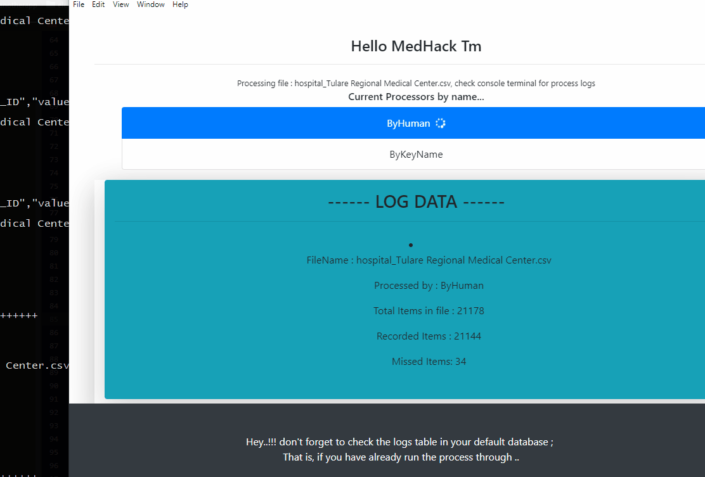

    ============================
    WHY THIS FOLDER AND SETUP
    ---------------------------
*   Processing a folder with many csv files is hectic especially when files have
huge streams of data, some data is lost to memory, and some files are read
simultaneously before the first one is done with.
*   To leverage nodes event system with ease (`https://nodejs.org/api/events.html`)
I have opted to use electron because of it's well defined events api, that is  built on top
of nodes event (`https://electronjs.org/docs/api/ipc-main`), and react js because
it's easier to update it's (React js) states via events and also call or send data
to electron (back-end) via such events. Thus allowing simultaneous csv file processing.
    Other alternatives are welcome for suggestions and discussions.
    
    ---------------
    HOW IT WORKS
    ----------------
*   In the root of this folder, fire up your favourite cli tool, make sure node is installed,
run `yarn install` OR `npm install` depending on your preferred package manager; to install
project dependencies.

*   After that run `yarn start` OR `npm start` (again depending on your package manager), to
start our render process on `localhost:3000`; this is react js powered, ignore the errors on
the tab that pops up. Open another cli window in the root of this folder and run `yarn electron`
OR `npm electron`, to start our electron process that loads `localhost:3000` as the view page.

*   Before firing up this app, make sure institution table is loaded with the latest data
as this app relies on that, check file name `institutions_latest.sql` in `SQLs` folder, and 
also [rawCSVs/filesToSort] folder should contain the csv files you wish to process.

*   Now our app is fired up, click Process csv files button to load csv data into database.
*   If you get an error on the console, click Process csv files button again to load another file.

    
    ---------------
        DEMO
    ----------------

